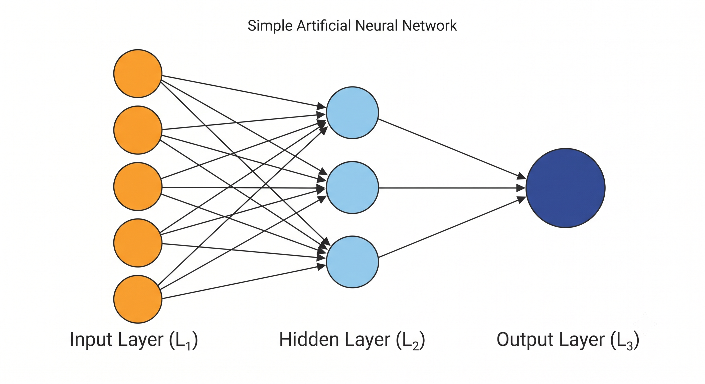

# aakaar.nn.Linear

Applies a linear transformation to the incoming data: $y = xA^T + b$.

### Signature

```python
aa.nn.Linear(in_features, out_features)
```

### Parameters

- in_features (int) – The size of each input sample (number of input features).
- out_features (int) – The size of each output sample (number of output features).

### Attributes

- weight (Tensor) – The learnable weight matrix of the module of shape (out_features, in_features). It is initialized with random values and requires_grad is set to True.
- bias (Tensor) – The learnable bias vector of the module of shape (out_features). It is initialized to zeros and requires_grad is set to True.

### Details

The Linear module implements a fully connected layer. When forward-passed, it performs a matrix multiplication of the input tensor with the weight matrix (transposed) and adds the bias vector.



This operation utilizes the internal aa.matmul engine for efficient compute dispatch. If the input is a batch of samples with shape (N, in_features), the resulting output will have shape (N, out_features).

Example:

```python
import aakaar as aa
import aakaar.nn as nn

# Initialize a linear layer mapping 128 features to 64 features
layer = nn.Linear(in_features=128, out_features=64)

# Create a random input batch of 10 samples
input_batch = aa.rand((10, 128))

# Forward pass
output = layer(input_batch)

print("Output shape:", output.shape) # (10, 64)
```